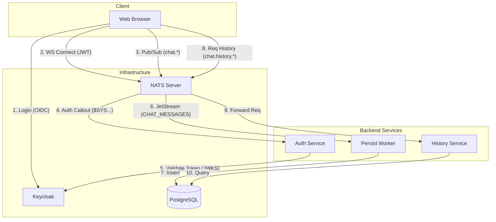

# Application Architecture Report: NATS Chat with Auth Callout + Keycloak

> Generated from codebase analysis on 2026-02-14

## Table of Contents

1. [Executive Summary](#1-executive-summary)
2. [Architecture Overview](#2-architecture-overview)
3. [Data Schema](#3-data-schema)
4. [Deployment Architecture](#4-deployment-architecture)
5. [Main User Journeys](#5-main-user-journeys)
6. [Observations & Recommendations](#6-observations--recommendations)

## 1. Executive Summary

The **NATS Chat with Auth Callout + Keycloak** application is a real-time messaging platform demonstrating a decoupled, event-driven architecture. It leverages **NATS JetStream** for message persistence and **Keycloak** (OIDC) for identity management. The system is designed to showcase advanced NATS features, specifically the **Auth Callout** mechanism, where NATS delegates authentication and authorization decisions to an external Go service.

The application consists of a React-based frontend and three core backend microservices written in Go. It uses **PostgreSQL** for long-term storage of message history and relies on the **OpenTelemetry** stack (Collector, Tempo, Prometheus, Loki, Grafana) for comprehensive observability. The deployment model is containerized using Docker Compose, orchestrating the interaction between the stateless web client, the message broker, and the backend services.

Key technologies include:
- **Frontend**: React, Vite, `nats.ws`, `keycloak-js`
- **Backend**: Go 1.22, NATS Client (`nats.go`), OpenTelemetry (`otel`)
- **Infrastructure**: NATS Server (JetStream), Keycloak, PostgreSQL
- **Observability**: OTel Collector, Grafana, Tempo, Prometheus, Loki

## 2. Architecture Overview

### Tech Stack Summary
- **Languages**: Go (Backend), TypeScript (Frontend)
- **Frontend Framework**: React 18, Vite
- **Messaging**: NATS, NATS WebSockets
- **Database**: PostgreSQL 16
- **Identity**: Keycloak 26 (OIDC)
- **Observability**: OpenTelemetry

### Service Inventory

| # | Service Name | Type | Tech | Purpose |
|---|-------------|------|------|---------|
| 1 | `web` | Frontend | React / TS | Chat UI, manages Keycloak auth & NATS WS connection |
| 2 | `auth-service` | Service | Go | Handles NATS Auth Callout (`$SYS.REQ.USER.AUTH`) |
| 3 | `history-service` | Service | Go | Serves message history via NATS Request/Reply |
| 4 | `persist-worker` | Worker | Go | Consumes JetStream messages and writes to DB |
| 5 | `nats` | Broker | NATS Server | Message broker, Auth delegation, JetStream persistence |
| 6 | `keycloak` | Identity | Keycloak | OIDC Provider, user management |
| 7 | `postgres` | Datastore | PostgreSQL | Persistent storage for chat messages |

### Data & Infrastructure Layer

| Component | Technology | Used By | Purpose |
|-----------|-----------|---------|---------|
| **NATS JetStream** | Message Broker | All Services | Async messaging, persistence (`CHAT_MESSAGES` stream) |
| **PostgreSQL** | Database | `persist-worker`, `history-service` | Long-term message storage (`messages` table) |
| **Keycloak** | Identity Provider | `web`, `auth-service` | User authentication, JWT issuance, JWKS provider |
| **OTel Collector** | Telemetry | All Go Services | Aggregates traces, metrics, and logs |

### Service Connectivity Map



## 3. Data Schema

### 3.1 PostgreSQL — `messages` Table

Defined in `postgres/init.sql`. This is the only persistent data store in the system.

```sql
CREATE TABLE messages (
    id          BIGSERIAL PRIMARY KEY,
    room        VARCHAR(255) NOT NULL,
    username    VARCHAR(255) NOT NULL,
    text        TEXT NOT NULL,
    timestamp   BIGINT NOT NULL,       -- epoch ms from client
    created_at  TIMESTAMPTZ DEFAULT NOW()
);

CREATE INDEX idx_messages_room_ts ON messages(room, timestamp DESC);
```

### 3.2 Chat Message (NATS Payload)

The JSON payload published to `chat.{room}` subjects and consumed by all services:

```json
{
  "user": "alice",
  "text": "Hello!",
  "timestamp": 1707900000000,
  "room": "general"
}
```

| Field | Type | Source | Description |
|-------|------|--------|-------------|
| `user` | string | Keycloak `preferred_username` | Message author |
| `text` | string | User input | Message body |
| `timestamp` | int64 | `Date.now()` (client) | Epoch milliseconds |
| `room` | string | UI room selector | Chat room name (maps to NATS subject) |

### 3.3 Keycloak Access Token (JWT Claims)

Extracted by the Auth Service in `keycloak.go`:

```json
{
  "preferred_username": "alice",
  "email": "alice@example.com",
  "email_verified": true,
  "realm_access": {
    "roles": ["admin", "user", "default-roles-nats-chat"]
  },
  "azp": "nats-chat-app",
  "iss": "http://localhost:8080/realms/nats-chat",
  "exp": 1707903600
}
```

### 3.4 NATS User JWT (Permissions)

Constructed by the Auth Service and returned to the NATS server. This JWT is **never seen by the client**.

| Keycloak Role | `Pub.Allow` | `Sub.Allow` | `Resp` |
|---------------|-------------|-------------|--------|
| `admin` | `chat.>`, `admin.>`, `_INBOX.>` | `chat.>`, `admin.>`, `_INBOX.>` | ✅ max 1 msg, 5 min |
| `user` | `chat.>`, `_INBOX.>` | `chat.>`, `_INBOX.>` | ✅ max 1 msg, 5 min |
| (none) | `_INBOX.>` | `chat.>`, `_INBOX.>` | ❌ |

Additional JWT fields: `BearerToken: true`, `Audience: "CHAT"`, `Expires: min(keycloak_exp, now + 1h)`.

### 3.5 JetStream Stream Configuration

Created by `persist-worker` at startup:

```json
{
  "name": "CHAT_MESSAGES",
  "subjects": ["chat.*", "admin.*"],
  "retention": "LimitsPolicy",
  "max_msgs": 10000,
  "max_age": "168h",
  "storage": "FileStorage"
}
```

Durable consumer: `persist-worker`, `AckExplicit`, `DeliverAll`.

### 3.6 NATS Accounts & Subjects

| Account | Users | Purpose |
|---------|-------|---------|
| `AUTH` | `auth` | Auth callout service only |
| `CHAT` | `persist-worker`, `history-service`, app users (via callout) | Application messaging |
| `SYS` | — | NATS system account |

| Subject Pattern | Direction | Description |
|-----------------|-----------|-------------|
| `chat.{room}` | Pub/Sub | Real-time chat messages |
| `chat.history.{room}` | Request/Reply | Fetch message history (last 50) |
| `admin.{channel}` | Pub/Sub | Admin-only channels |
| `$SYS.REQ.USER.AUTH` | Request/Reply | Auth callout (internal) |
| `_INBOX.>` | Reply | NATS request/reply inbox |

## 4. Deployment Architecture

### Container Topology
The system is defined in `docker-compose.yml` and consists of network-isolated containers:

- **nats**: Exposes 4222 (TCP), 9222 (WS), 8222 (Monitor). Core hub.
- **keycloak**: Exposes 8080. imports `realm-export.json` on startup.
- **postgres**: Exposes 5432. Initializes with `init.sql` to create `messages` table.
- **web**: Exposes 3000. Built from `./web` Dockerfile.
- **Go Services** (`auth-service`, `persist-worker`, `history-service`):
  - Do NOT expose external ports.
  - Connect OUT to NATS and OTel Collector.
  - `persist-worker` and `history-service` connect OUT to Postgres.
- **Observability Stack**: `otel-collector` (4317), `prometheus` (9090), `grafana` (3001), `tempo`, `loki`.

### Environment Configuration
Configuration is injected via Environment Variables in `docker-compose.yml`:

- **Shared**: `NATS_URL`, `OTEL_EXPORTER_OTLP_ENDPOINT`
- **Auth Service**: `KEYCLOAK_URL`, `ISSUER_NKEY_SEED`, `XKEY_SEED` (Secrets for signing/encryption)
- **Database Consumers**: `DATABASE_URL` (Postgres connection string)
- **Web**: `VITE_KEYCLOAK_URL`, `VITE_NATS_WS_URL` (Build-time vars)

**Note**: Secrets (NATS passwords, Postgres passwords, NKeys) are currently hardcoded in `docker-compose.yml` and `nats-server.conf` for demonstration purposes.

### Scaling & Availability Signals
- **Stateless Services**: `auth-service` and `history-service` are stateless and can be horizontally scaled (though NATS Queue Groups would be needed for load balancing requests).
- **Worker Scaling**: `persist-worker` uses a durable JetStream consumer. To scale, it would require queue group configuration to avoid duplicate processing, or relying on JetStream's consumer load balancing.
- **Resilience**: 
  - Go services implement retry logic (30 attempts) for NATS and DB connections on startup.
  - `persist-worker` uses JetStream `AckExplicit` to ensure no message loss.

## 5. Main User Journeys

### Journey 1: Auth & Login
**Entry point**: User opens Web UI
**Services involved**: `web` → `keycloak` → `nats` → `auth-service`

**Flow:**
1. **Client** loads and initializes `AuthProvider`.
2. **Client** redirects to **Keycloak** if no valid session exists.
3. User logs in; **Keycloak** returns Access Token (JWT).
4. `NatsProvider` initiates WebSocket connection to **NATS**, passing the JWT as the authentication token.
5. **NATS** pauses connection and publishes request to `$SYS.REQ.USER.AUTH`.
6. **Auth Service** receives request, decrypts it (using XKey).
7. **Auth Service** fetches JWKS from **Keycloak** to validate the user's JWT.
8. **Auth Service** constructs a generic NATS User JWT with permissions mapped from Keycloak roles.
9. **Auth Service** signs and returns the User JWT to **NATS**.
10. **NATS** accepts the connection.

### Journey 2: Chat / Messaging
**Entry point**: User types message in `ChatRoom`
**Services involved**: `web` → `nats` → `persist-worker` → `postgres`

**Flow:**
1. **Client** publishes JSON message to `chat.{room}`.
2. **NATS** receives message.
3. **NATS** (JetStream) captures message into `CHAT_MESSAGES` stream (configured for `chat.*`).
4. **Persist Worker** (Durable Consumer) pulls message from stream.
5. **Persist Worker** unmarshals JSON, extracts trace context.
6. **Persist Worker** inserts message into **PostgreSQL** `messages` table.
7. **Persist Worker** ACKs the message to JetStream.
8. (Simultaneously) Other subscribed **Clients** receive the message via WebSocket.

### Journey 3: History / Persistence
**Entry point**: User switches rooms or loads app
**Services involved**: `web` → `nats` → `history-service` → `postgres`

**Flow:**
1. **Client** (`ChatRoom`) sends NATS Request to `chat.history.{room}`.
2. **NATS** routes request to **History Service** (Queue Subscription).
3. **History Service** executes SELECT query on **PostgreSQL** `messages` table (ordered by timestamp DESC, limit 50).
4. **History Service** marshals results to JSON and sends NATS Reply.
5. **Client** receives history and updates state.

## 6. Observations & Recommendations

**Notable Patterns:**
- **Auth Callout**: The use of NATS Auth Callout effectively decouples the broker from the identity provider, allowing for custom logic (Role -> Permission mapping) without modifying the broker or client.
- **Trace Propagation**: Manual extraction and injection of W3C Trace Context in NATS headers (`otelhelper`) ensures end-to-end visibility from the React frontend deep into Postgres queries.
- **Polyglot Persistence**: Ephemeral/buffer storage in JetStream vs. long-term storage in Postgres is a classic robust pattern for chat apps.

**Potential Issues:**
- **Hardcoded Secrets**: NKeys and passwords in `docker-compose.yml` should be moved to `.env` files or secret managers for production.
- **Client-Side Scalability**: `MessageList` renders all messages in the array. For very long histories, virtualization (windowing) would be needed.
- **Queue Groups**: `history-service` subscribes to `chat.history.*`. To run multiple replicas, it should use a Queue Group (e.g., `nc.QueueSubscribe(..., "history-workers", ...)` ) to load balance requests.

### 6.1 Connectivity & Security Risks (Direct vs. Gateway)

Connecting clients directly to the NATS WebSocket port (9222) instead of via an Ingress Gateway introduces several critical risks:

| Risk Domain | Risk Description | Mitigation (Gateway/Ingress) |
|---|---|---|
| **Security (SSL/TLS)** | NATS is configured with `no_tls: true`. Direct exposure sends authentication tokens and messages in cleartext. | Ingress handles TLS termination, ensuring encrypted transport (WSS) without complicating NATS config. |
| **Authentication Enforcement** | Direct connection relies solely on NATS app-level auth. Malicious actors can flood the socket with connection attempts (TCP Connect Flood). | Gateways can validate JWTs, enforce IP allowlists, or use WAFs to block illegitimate traffic *before* it reaches the broker. |
| **DDoS & Rate Limiting** | NATS is optimized for high throughput, not edge protection. It lacks sophisticated rate-limiting (e.g., per-IP limits) and DDoS mitigation controls. | Ingress controllers (Nginx, Traefik) provide robust rate-limiting, connection throttling, and circuit breakers. |
| **Network Topology** | Direct exposure requires opening non-standard ports (9222) to the public internet, which many corporate firewalls block. | Ingress allows multiplexing WebSocket traffic over standard port 443 (e.g., `wss://api.domain.com/nats`), ensuring maximum firewall compatibility. |
| **Load Balancing & Failover** | Client-side load balancing requires the client to know the IP list of all server nodes. This leaks topology and acts as a poor load balancer. | A Gateway provides a stable VIP (Virtual IP) / DNS entry. It handles blue/green deployments and failover transparently to the client. |

